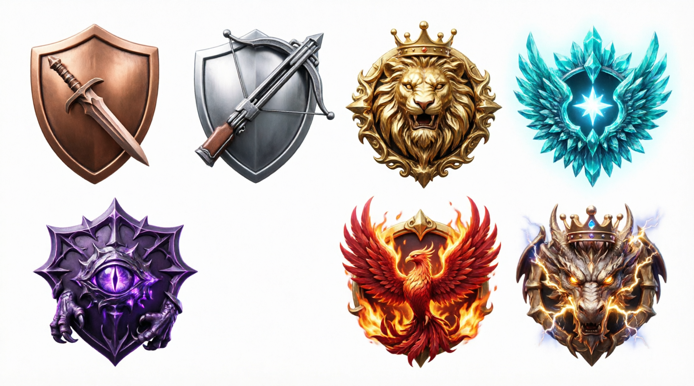
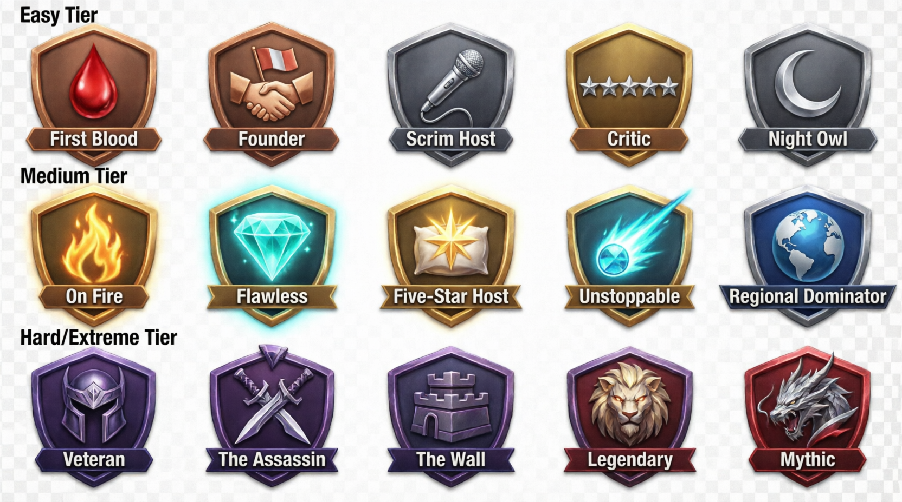

# MLBB Scrim Host

<p align="center">
  
</p>

An Android app for hosting and managing scrims (practice matches) for Mobile Legends: Bang Bang (MLBB). Built with Kotlin, Jetpack Compose, and Supabase.

## 🏆 Premium Achievement System

The app features a professional, gamified "Trophy Room" with live progress tracking and custom-designed badges.

<p align="center">
  
</p>

- **Live Progress Tracking**: Real-time progress bars for all milestones.
- **Categorized Challenges**: Combat, Social, Elite, and General categories.
- **Up Next Hero Card**: Automatically displays your closest upcoming milestone.
- **Role Mastery**: Specific tracking for Jungler, Roamer, and other roles.
- **Elite Milestones**: Track win streaks (up to 20!) and high-rating consistency.

## 🖥️ Live Admin Panel

The project includes a production-ready management interface for administrators to monitor the ecosystem.

**🌐 Live URL**: [https://mlbb-admin.vercel.app/](https://mlbb-admin.vercel.app/)

- **Luxury Dark UI**: Built with a high-end, modern aesthetic for professional management.
- **Scrim Verification**: Queue-based system for validating match results and screenshots.
- **User & Team Management**: Full control over profiles, rankings, and team rosters.
- **Real-time Monitoring**: Live status of active scrims and system health.
- **News Engine**: Directly push updates and announcements to the mobile application.

## 🚀 Features

- **User Authentication**: Email/password registration and login with a premium UI.
- **Team Management**: Create teams, invite players (3-7 members), manage team settings.
- **Scrim Scheduling**: Post available scrim slots with date/time.
- **Scrim Search**: Find and apply to scrims from other teams.
- **Real-time Chat**: Communicate with opposing team leaders in a high-performance chat interface.
- **Match Verification**: Upload game screenshots for admin verification.
- **Advanced Ranking System**: 7-tier ranking system (Bronze → Mythic) with custom high-end icons.
- **Admin Control**: Integrated dashboard for total ecosystem management.

## 🛠️ Tech Stack

- **Frontend**: Kotlin + Jetpack Compose
- **Backend**: Supabase (PostgreSQL, Auth, Storage, Realtime)
- **News Service**: Production-grade service deployed on Render.
- **Admin Dashboard**: React/Next.js with "Luxury Dark" design system.

## 🎨 Design System

The app features an MLBB-themed design with:
- **Epic Gaming Fantasy Aesthetic**: Premium dark mode with gold and cyan accents.
- **Glassmorphism**: Modern UI components with blur and transparency effects.
- **Custom Typography**: Rajdhani, Roboto, and Teko for a true gaming feel.
- **Custom Assets**: High-resolution icons for all achievements and rank tiers.

## 📂 Project Structure

```
Android/
├── app/
│   ├── src/main/java/com/mlbb/scrim/
│   │   ├── data/
│   │   │   ├── model/          # Data models (Achievement, Profile, Team, etc.)
│   │   │   ├── repository/     # Repository classes for data access
│   │   │   └── service/        # Supabase client and services
│   │   ├── ui/
│   │   │   ├── screens/        # Trophy Room, Scrim Search, Chat, etc.
│   │   │   ├── components/     # Achievement badges, Rank icons, Shimmer skeletons
│   │   │   └── theme/          # Custom color palette and typography
│   │   └── viewmodel/          # ViewModels for UI state
│   └── build.gradle.kts
├── supabase/
│   ├── schema.sql              # Database table definitions
│   └── triggers.sql            # Database triggers (profile sync, XP calculation)
└── README.md                   # Project documentation
```

## 📋 Setup Instructions

### Prerequisites

- Android Studio Hedgehog (2023.1.1) or later
- JDK 17
- Android SDK 34
- Supabase account

### 1. Supabase Setup

1. Create a new project at [supabase.com](https://supabase.com)
2. Run `supabase/schema.sql` in the SQL Editor.
3. Update `is_admin = true` for your admin account.
4. Configure a `screenshots` storage bucket.

### 2. Android Project Setup

1. Open in Android Studio.
2. Update Supabase credentials in `SupabaseClient.kt`.
3. Sync Gradle and build the project.

## 📊 Current Implementation Status

### Completed ✅
- **Auth System**: Login/Register with premium UI and session management.
- **Achievement System**: Full "Trophy Room" with live progress tracking.
- **Custom Assets**: Sliced and integrated achievement and tier icons.
- **Production Deployment**: News Service live on Render.
- **Chat System**: Real-time messaging with opposing teams.
- **Match Verification**: Screenshot upload and point calculation.

### In Progress 🚧
- Push notifications for achievement unlocks.
- Haptic feedback integration.

## 🏗️ Build Commands

```bash
# Build debug APK
./gradlew assembleDebug

# Clean build
./gradlew clean
```


For issues or questions, please refer to the project documentation or create an issue in the repository.